# Multimodal Analysis of Voice, Gait and Handwriting Signals for Parkinson Disease Detection

A multimodal deep learning framework for Parkinson's disease detection by integrating handwriting images, gait signals, and voice recordings using decision level (late) fusion and explainable AI techniques.

---

## Project Overview

Parkinson's disease (PD) is a progressive neurodegenerative disorder that affects movement, speech, and motor coordination. Early diagnosis is essential for timely treatment and improved patient care.

This project presents a multimodal framework that combines three complementary biomarkers:

* Handwriting Images
* Gait Signals
* Voice Recordings

Each modality is analyzed using its most suitable machine learning or deep learning model, and the prediction probabilities are fused using a decision level (late) fusion strategy to improve overall diagnostic performance. Explainable AI techniques are incorporated to provide transparency and interpretability of the predictions.

---

## Features

* Handwriting based PD detection using DenseNet121
* Gait analysis using CNN BiLSTM
* Voice analysis using Ensemble Learning
* Decision level (Late) Fusion
* Explainable AI using Grad CAM and PCA
* Interactive Graphical User Interface
* Multimodal prediction framework

---

# System Architecture

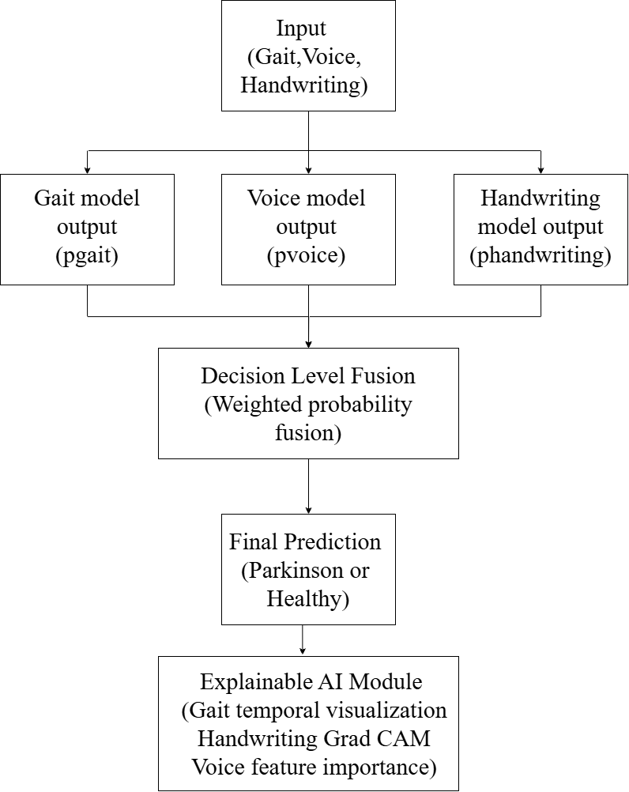

---

# Decision Level Fusion

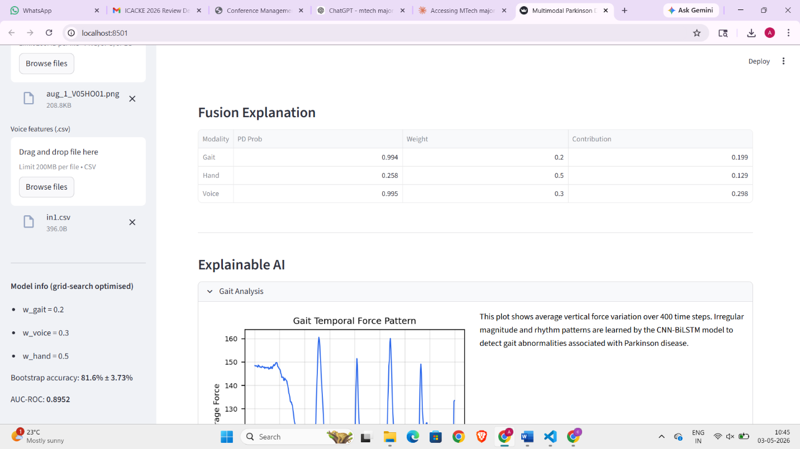

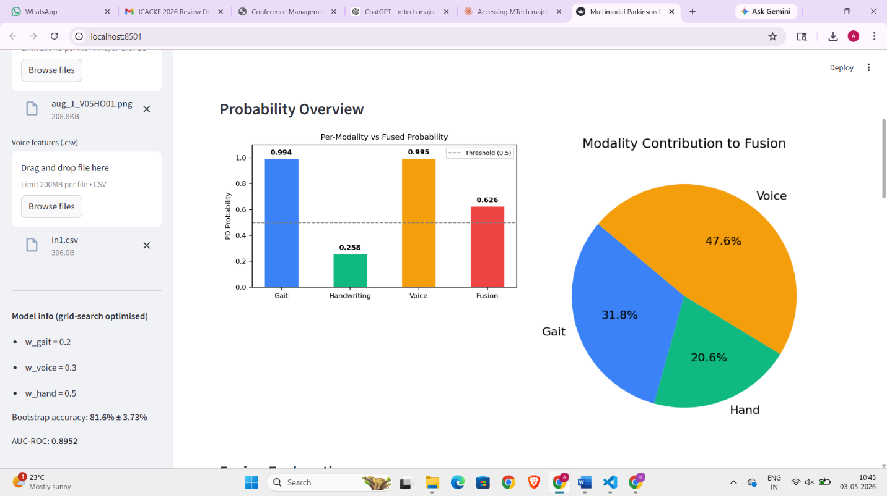

---

# Individual Models

## Handwriting Model

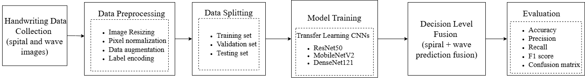

## Gait Model

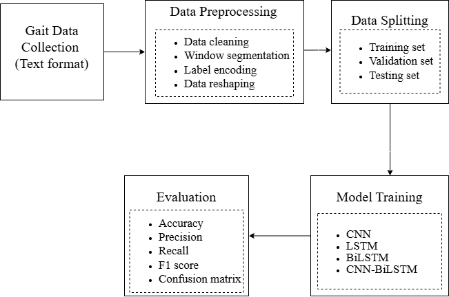

## Voice Model

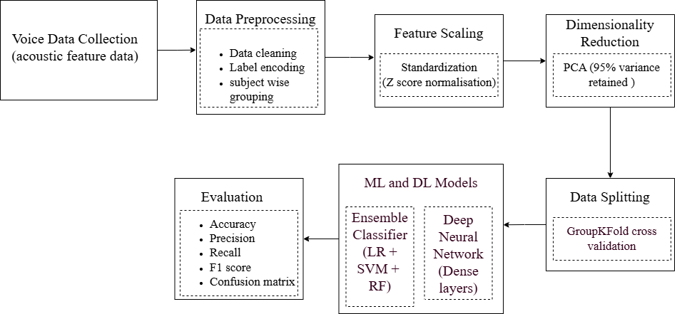

---

# Explainable AI

## Grad CAM Visualization

### Spiral Drawing

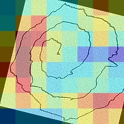

### Wave Drawing

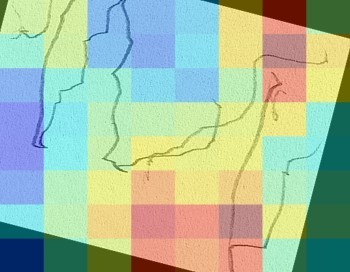

---

## Voice Feature Importance

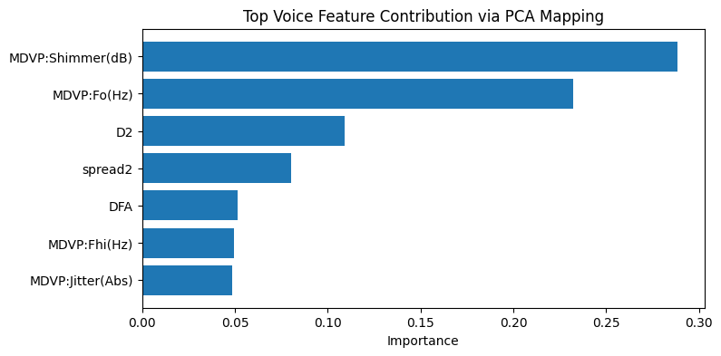

---

## Gait Signal Analysis

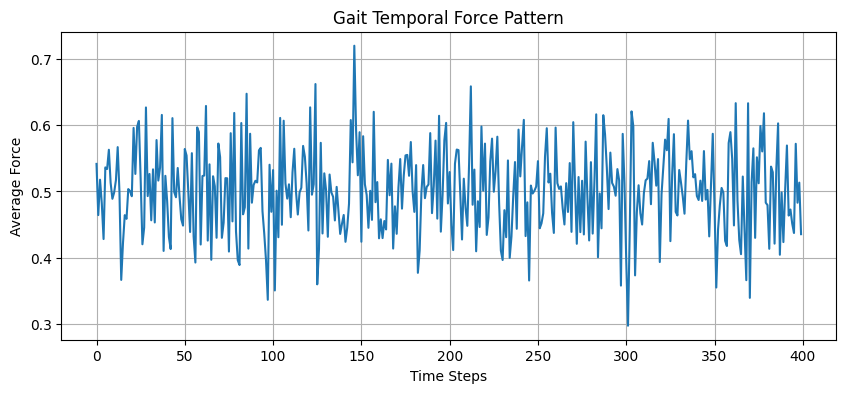

---

# Graphical User Interface

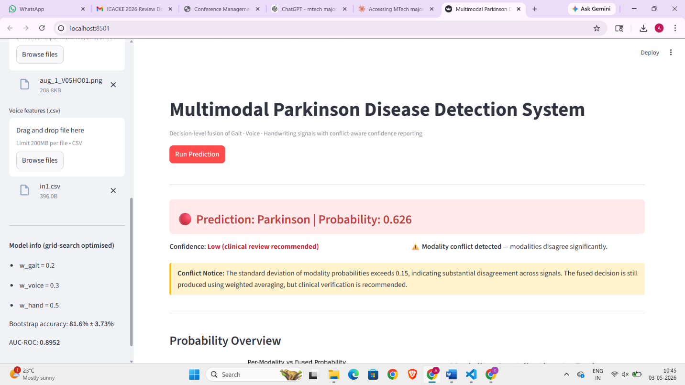

---

# Technologies Used

* Python
* TensorFlow
* Keras
* Scikit Learn
* OpenCV
* NumPy
* Pandas
* Matplotlib
* SHAP

---

# Datasets

### Handwriting Dataset

Parkinson's Augmented Handwriting Dataset (Kaggle)

### Gait Dataset

PhysioNet Gait in Parkinson Disease Database

### Voice Dataset

Voice Samples for Patients with Parkinson's Disease and Healthy Controls

---

# Repository Structure

```text
Parkinson-Disease-Detection-Multimodal/
│
├── app.py
├── fusion.py
├── pd_gait.ipynb
├── pd_handwriting.ipynb
├── pd_voice.ipynb
├── images/
├── requirements.txt
├── README.md
└── LICENSE
```

---

# Installation

Clone the repository

```bash
git clone https://github.com/amulyajayaram/Parkinson-Disease-Detection-Multimodal.git
```

Install the required libraries

```bash
pip install -r requirements.txt
```

---

# Usage

Run the application

```bash
python app.py
```

---

# Methodology

1. Data acquisition from handwriting, gait, and voice datasets.
2. Data preprocessing and feature extraction.
3. Training modality specific machine learning and deep learning models.
4. Individual prediction generation.
5. Decision level fusion of prediction probabilities.
6. Explainable AI analysis using Grad CAM and PCA.
7. Final Parkinson's disease prediction.

---

# Results

The proposed multimodal framework combines handwriting, gait, and voice predictions using decision level fusion to improve Parkinson's disease detection performance. The system also provides interpretable predictions through Grad CAM visualizations and PCA based feature analysis, making the framework suitable for computer aided clinical decision support.

---

# Conference Publication

This work was accepted and presented at the **2026 International Conference on Advances in Computing, Knowledge Engineering and Emerging Technologies (ICACKE 2026)(IEEE)**.

**Paper Title**

**Multimodal Analysis of Voice, Gait and Handwriting Signals for Parkinson Disease Detection**

---

# Future Work

* Incorporate wearable sensor data.
* Extend the framework to additional neurological disorders.
* Deploy the model as a cloud based clinical decision support system.
* Improve multimodal fusion using transformer based architectures.

---

# License

This project is licensed under the MIT License.

---

